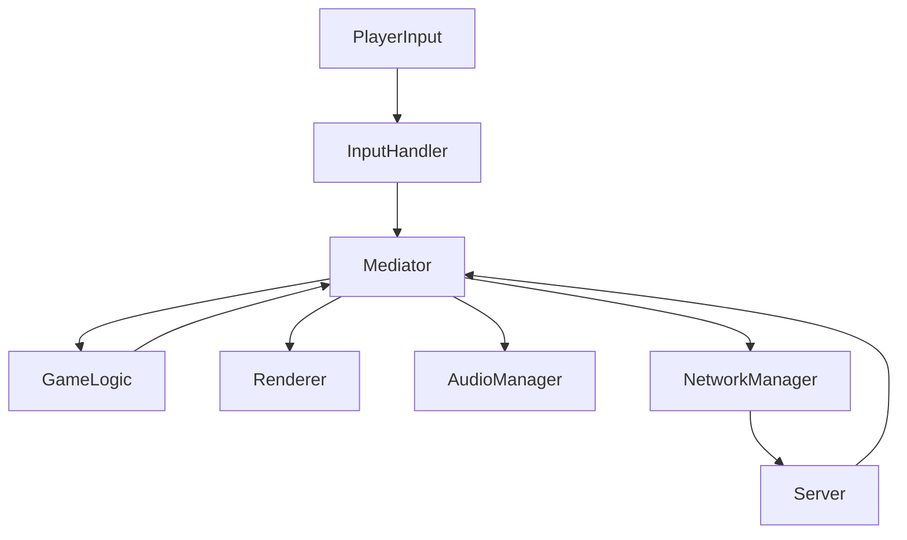

# This files serves as the bible of architecture constraints and guidelines that we will follow to develop the Game Engine

It comes as the first task we have to do, in which Matheus, Mario and Alex will research common patterns such as Entity-Component-System (ECS) and Mediator design patterns.

## Mediator design pattern

The **Mediator Design Pattern** is a behavioral design pattern that centralizes communication between different components (or "colleagues") in a system. Instead of components interacting directly with one another, they communicate through a central Mediator. This reduces the complexity of dependencies and allows components to remain decoupled, making the system easier to extend and maintain.

### Key Characteristics of the Mediator Design Pattern
1. **Centralized Communication**:
   - The Mediator acts as a hub for communication between different components.
   - It ensures that no component directly depends on another, improving modularity.

2. **Decoupling of Components**:
   - Components (or colleagues) only interact with the Mediator.
   - This eliminates the need for components to know about each other.

3. **Enhanced Maintainability**:
   - Changes to the behavior of one component do not directly affect others.
   - New components can be added with minimal impact on the existing system.

4. **Simplified Interaction**:
   - Complex systems with many interdependent components become easier to understand and manage.

---

In our case the  **MDP** will be used to manage communication between the various subsystems of the game engine. This pattern will help decouple key components like rendering, user input, game logic, resource management, and networking. By implementing a Mediator, we can ensure these subsystems interact centrally, maintaining a modular and maintainable architecture.

---

### Objectives
- **Subsystem Decoupling**: Each subsystem will interact only with the Mediator, eliminating direct dependencies.
- **Centralized Management**: The Mediator will orchestrate events such as user input, game state updates, and rendering.
- **Flexibility and Scalability**: Facilitate the addition or modification of subsystems without impacting the rest of the engine.

### Implementation
The Mediator will act as the central controller coordinating the following subsystems:
1. **InputHandler**: Handles user inputs and communicates them to the Mediator.
2. **Renderer**: Renders graphics based on data provided by other subsystems.
3. **AudioManager**: Plays sounds triggered by game events.
4. **NetworkManager**: Handles client-server synchronization.
5. **GameLogic**: Implements game rules and notifies the Mediator of significant events (e.g., collisions, state changes).

Each subsystem will act as a "colleague" reporting its events and actions to the Mediator.

### Advantages
- **Simplified Communication Flow**: Reduces cross-dependencies between subsystems.
- **Maintainability**: Changes can be applied more easily due to centralized interaction logic.
- **Scalability**: Easier integration of new subsystems or features.
- **Simpler Unit Testing**: Subsystems can be tested in isolation.

### Disadvantages
- **Mediator Complexity**: As more subsystems are added, the Mediator can become overly complex.
- **Single Point of Failure**: If not designed carefully, the Mediator can become a bottleneck.

### Example
The Mediator will handle key events, such as:
- When the player fires, the Mediator will notify the `Renderer` to display the shot and the `NetworkManager` to send the information to the server.
- When the server detects a collision, it will notify the Mediator, which will coordinate sound playback via the `AudioManager` and update graphics through the `Renderer`.

### Interaction Diagram

The interaction diagram illustrates how the Mediator Design Pattern coordinates the communication between subsystems. Here's how it works:

1. **Player Input**: Player actions are captured by `PlayerInput` and sent to the `InputHandler`.
2. **Input Handling**: The `InputHandler` processes the input and forwards it to the `Mediator`.
3. **Game Logic Coordination**: The `Mediator` sends relevant inputs to the `GameLogic` to update the game state (e.g., player actions, collisions, or movements) and the `GameLogic` sends back events or game state changes back to the Mediator for further coordination.
4. **Output Notification**:
    - The `Mediator` notifies the `Renderer` to update the visuals.
    - The `AudioManager` is notified to play sound effects related to the input or game events.
    - The `NetworkManager` synchronizes the local actions with the server.
5. **Server Communication**: The `NetworkManager` sends data to the server and processes responses, which are then passed back to the `Mediator`.
6. **Final Updates**: Based on server responses, the `Mediator` updates subsystems like `Renderer` to reflect changes in the game world.

## Game Loop with Subsystems

### **What is the Game Loop with Subsystems Architecture?**

The **Game Loop with Subsystems** is an architecture that organizes the client into distinct subsystems, each responsible for a specific functionality, while the **Game Loop** coordinates the sequential and linear execution of these subsystems.

#### **Components of the Game Loop with Subsystems**

1. **Game Loop**:
   - The core of the client, controlling the game's execution flow.
   - Runs the subsystems in the required order for each frame.

2. **Subsystems**:
   - **InputHandler**: Captures player input (keyboard, mouse, etc.).
   - **NetworkManager**: Manages communication with the server, sending commands and receiving updates.
   - **GameState**: Stores the current game state (positions, entity statuses, etc.).
   - **Renderer**: Renders graphical elements on the screen based on the game state.

---

### **How It Works**

The **Game Loop** follows a well-defined sequence of steps, ensuring that each subsystem executes its function at the right moment:

1. **Input Capture**:
   - The `InputHandler` processes keyboard/mouse events and converts player input into commands.

2. **Message Sending and Receiving**:
   - The `NetworkManager` sends player commands to the server.
   - It also receives game state updates sent by the server.

3. **Game State Update**:
   - The `GameState` applies updates received from the server, modifying entity positions and statuses.

4. **Rendering**:
   - The `Renderer` draws the updated game state on the screen, ensuring the player sees real-time changes.

---

### **Why Use This Architecture?**

A Game Loop with Subsystems is the best approach for this client. It provides a simple and efficient structure, with clearly defined subsystems for input, communication and rendering.

#### **Advantages**

1. **Simplicity**:
   - The linear structure of the Game Loop is easy to understand and implement.
   - Each subsystem has a clear, well-defined responsibility.

2. **Modularity**:
   - Subsystems are independent, allowing them to be modified or replaced without affecting the rest of the code.

3. **Performance**:
   - Since the client does not handle complex logic, this architecture ensures low latency and high efficiency.

4. **Ease of Integration**:
   - The Game Loop naturally connects subsystems with the server, simplifying communication and game state synchronization.

5. **Scalability**:
   - New features can be added as new subsystems without altering the core loop.

---

### **Why Not Use More Complex Architectures As ECS?**

In **R-Type**, all game logic is processed on the server, while the client acts as a graphical and input interface. Using more complex architectures, such as **Entity-Component-System (ECS)**, would introduce disadvantages:

1. **Unnecessary Complexity**:
   - ECS is designed to manage logic and behavior in games, which is unnecessary on the client since the server handles these functions.

2. **Overhead**:
   - ECS would add unnecessary abstractions, making maintenance harder and reducing code simplicity.

3. **Client Focus**:
   - The client needs to be lightweight and efficient, focusing on rendering graphics and capturing inputs. ECS would be excessive for these responsibilities.

---

### **When to Use the Game Loop with Subsystems?**

This is ideal for:
- Clients acting as graphical and input interfaces, with logic processed on the server.
- Projects where simplicity and performance are priorities.
- Small to medium-sized games that do not require complex systems on the client.

---

### **Expansion with a Factory**

If the client needs to dynamically create entities (like players, enemies, or projectiles) based on server messages, we can integrate a **Factory** into the `NetworkManager` subsystem. This maintains modularity and simplifies entity creation.

---

### **Differences Between Game Loop with Subsystems and Mediator Design Pattern**

1. **Purpose and Control**:
   - **Mediator Design Pattern**:
     - A design pattern focused on **orchestrating communication**.
     - Components call the Mediator to notify events and the Mediator decides how to forward information to other components.
   - **Game Loop with Subsystems**:
     - The main loop is **imperative**. It explicitly decides the order and methods each subsystem should execute.
     - There is no notification between subsystems. The flow is linear and controlled by the loop.

2. **Relationship with Subsystems**:
   - **Mediator Design Pattern**:
     - Subsystems depend on the Mediator to manage communication. They notify the Mediator about specific events and wait for it to make decisions.
   - **Game Loop**:
     - Subsystems do not directly depend on the loop. Instead, the loop directly calls each subsystem to perform its tasks.

3. **Complexity**:
   - **Mediator Design Pattern**:
     - Can be more complex, especially when dealing with many event types or advanced communication logic.
   - **Game Loop**:
     - Simpler and more straightforward, particularly in a client where calls are predictable.

--- 

### **Conclusion**

The **Game Loop with Subsystems** architecture is a practical, efficient and modular solution for the client, perfectly aligning with its responsibilities: capturing input, synchronizing with the server and rendering graphics. Its simplicity and extensibility make it ideal for this type of project.

If we want to add new subsystems or features, this architecture provides a clear and scalable path for the client's growth.

## Libraries

There's a big community behind SFML, and they have various libs that will supercharge us:

- [Thor](https://github.com/Bromeon/Thor?tab=readme-ov-file) | [Docs](https://bromeon.ch/libraries/thor/)

SFML extension, notable features (particles, animations, resource management, time measurement utilities as clock stopping and better vector support)

SFML 2.x compatible and crossplatform.

- [SelbaWard](https://github.com/Hapaxia/SelbaWard) | [Docs](https://github.com/Hapaxia/SelbaWard/wiki) | [Examples](https://en.sfml-dev.org/forums/index.php?topic=19496.0)

This is a MUST, plenty of drawables we can 'easily' add to our project. We'll have to validate it works correctly with Thor.

Docs include setup and tutorials.
Master/main branch is SFML2.X

- [SFNUL](https://github.com/binary1248/SFNUL?tab=readme-ov-fil)

Asios (networking) wrapper finetuned for using it in SFML.

You can find the API documentation in the doc sub-directory, build it with Doxygen.

We'll have to do our due dilligence to see if it's worth.

SFML 2.x support

- [CheeseMap](https://github.com/Hapaxia/CheeseMap?tab=readme-ov-file) | [Docs](https://github.com/Hapaxia/CheeseMap/wiki) | [Demo](https://www.youtube.com/watch?v=de0OGuVQkGk)

Layered map builder, cool animations for backgrounds.

Be careful, it's not popular and may have lots of problems.

SFML2.x support