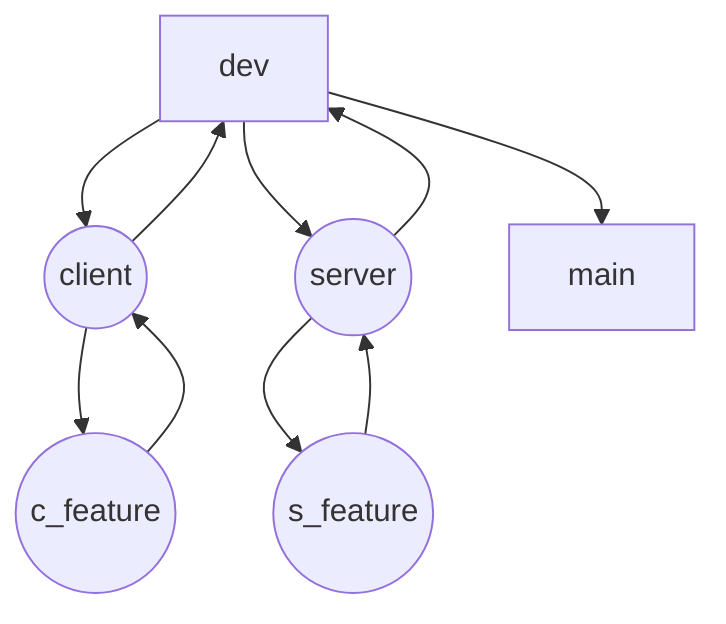

# Developer documentation

## Table of Contents
1. [Getting Started](#getting-started)
    - [Prerequisites](#prerequisites)
    - [Installation](#installation)
    - [Usage](#usage)
    - [Branching system](#branching-system)
    - [Formatting rules](#formatting-rules)
2. [Architecture](#architecture)
3. [Protocol](#protocol)
4. [License](#license)

## Getting Started

### Prerequisites
Ensure you have the following dependencies installed:  
- Operating System: `Linux/macOS/Windows`  
- Package Manager: [Conan](https://conan.io/)  
- **CMake**: For managing the build process.
- **Make**: For building the project.
- **C++**: The programming language used for development.

### Installation
1. Clone the repository:
   ```bash
   git clone https://github.com/ItsZcx/r-type.git
   ```
2. Navigate to the project directory:
   ```bash
   cd r-type
   ```
3. Set up environment variables:
   ```bash
   make install
   ```

### Usage

To run the project, you can use the provided Makefile which includes commands to build and run both the server and the client.

1. **Build the project:**
    ```bash
    make build
    ```

2. **Run the server:**
    ```bash
        ./server [PORT]
    ```

3. **Run the client:**
    ```bash
        ./client
    ```

When you run the client, it will prompt you to enter the server IP. If you are running both the server and client on the same machine, provide the IP in the format `127.0.0.1:PORT`. Otherwise, provide the appropriate server IP and port.

### Branching system


**Explanation:**
1. **`main` branch**: The final, stable branch (`main`) is updated with tested and completed changes from `dev`.
2. **`dev` branch**: The main development branch, which integrates changes from the `client` and `server` branches.
3. **`client` & `server` branches**: These branches handle module-specific development. They integrate work from their respective feature branches (`c_feature` and `s_feature`).
4. **Feature branches (`c_feature` & `s_feature`)**: Temporary branches created for individual features. These branches have custom names (e.g., s_tcp_support, c_sfml_support). Once a feature is completed and stable, it is merged into its corresponding module branch (client or server).

#### Formatting rules
Use `clang-format` to ensure consistent code style.

- **Format a specific file**:  
  ```bash
  clang-format -style=file [FILE] -i
  ```

- **Format all files in the current directory**:  
  ```bash
  find . -regex '.*\.\(cpp\|hpp\|cc\|cxx\)' -exec clang-format -style=file -i {} \;
  ```

## Architecture

For detailed information on the project architecture, refer to the [Architecture documentation](ARCHITECTURE.md).

## Protocol

For detailed information on the communication protocol, refer to the [Protocol documentation](PROTOCOL.md).

## License

This project is licensed under the [MIT License](LICENSE).
